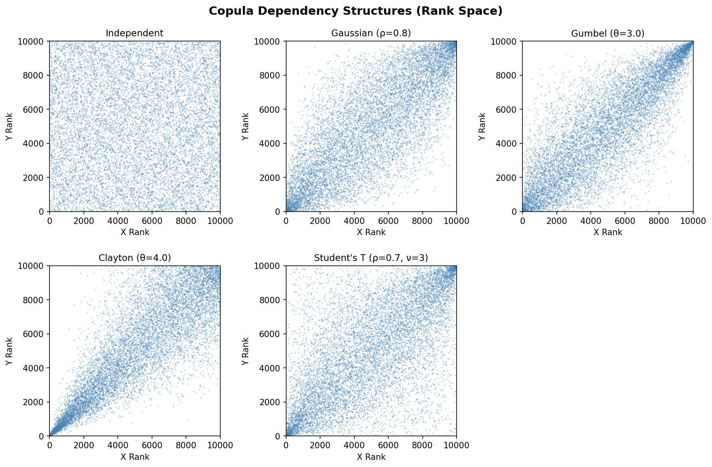

# Coupling Groups, Copulas and Variable Reordering

This guide explains how PAL manages dependencies between stochastic
variables. It covers three interconnected concepts:

1. **Coupling Groups** — automatic tracking of related variables
2. **Copulas** — creating dependency structures between variables
3. **Variable Reordering** — how copulas work under the hood

A runnable version of all examples below is available at
`examples/example_couplings_and_copulas.py`.

## 1. Coupling Groups

### What Is a Coupling Group?

Every `StochasticScalar` in PAL belongs to a **coupling group** — a
set of variables that are linked by computation. When you create an
independent variable, it gets its own coupling group. When you combine
variables in arithmetic, their coupling groups merge.

```python
from pal import config, distributions, set_random_seed

config.n_sims = 10_000
set_random_seed(42)

motor = distributions.LogNormal(mu=14, sigma=0.5).generate()
prop = distributions.LogNormal(mu=15, sigma=0.8).generate()

# Each starts in its own group
motor.coupled_variable_group is prop.coupled_variable_group
# => False
```

When variables are combined, they become coupled:

<!--pytest-codeblocks:cont-->

```python
total = motor + prop

# Now all three share the same coupling group
motor.coupled_variable_group is prop.coupled_variable_group
# => True

len(motor.coupled_variable_group)
# => 3
```

Derived variables also join automatically:

<!--pytest-codeblocks:cont-->

```python
motor_with_expenses = motor * 1.1

motor_with_expenses.coupled_variable_group is motor.coupled_variable_group
# => True

len(motor.coupled_variable_group)
# => 4
```

### Why Coupling Groups Matter

Coupling groups solve a critical problem: **when a copula reorders one
variable's simulations, all related variables must be reordered in
exactly the same way** to preserve their mathematical relationships.

Consider this scenario:

<!--pytest-codeblocks:cont-->

```python
set_random_seed(42)
loss_a = distributions.LogNormal(mu=14, sigma=0.5).generate()
loss_b = distributions.LogNormal(mu=15, sigma=0.8).generate()

# Derive a variable from loss_a
loss_a_expenses = loss_a * 1.15  # 15% expense loading
```

Before any copula, `loss_a` and `loss_a_expenses` have a perfect 1.15×
relationship because simulation `i` of both variables corresponds to the
same underlying scenario:

```
loss_a first 5:          [1751476. 1113583. 2057538. 1557236.  622980.]
loss_a_expenses first 5: [2014197. 1280620. 2366169. 1790821.  716427.]
Ratio:                   [1.15 1.15 1.15 1.15 1.15]
```

Now apply a copula to correlate `loss_a` with `loss_b`:

<!--pytest-codeblocks:cont-->

```python
from pal import copulas

copulas.GaussianCopula(
    [[1.0, 0.7], [0.7, 1.0]]
).apply([loss_a, loss_b])
```

After the copula reorders `loss_a`, the 1.15× ratio is **preserved**:

```
Ratio (still 1.15!): [1.15 1.15 1.15 1.15 1.15]
```

This works because PAL's coupling group system automatically reordered
`loss_a_expenses` with the same permutation as `loss_a`.

**Without coupling groups**, `loss_a_expenses` would retain its original
ordering while `loss_a` was shuffled, breaking the 1.15× relationship
and producing nonsensical results.

## 2. Copulas

A copula defines a dependency structure (correlation pattern) between
random variables. PAL provides several copula families, each producing
different patterns of dependence, especially in the tails.

### Available Copula Types

| Family | Class | Key Parameters | Tail Dependence |
|--------|-------|----------------|-----------------|
| **Elliptical** | | | |
| Gaussian | `GaussianCopula` | Correlation matrix | None |
| Student's T | `StudentsTCopula` | Correlation matrix, `dof` | Symmetric |
| **Archimedean** | | | |
| Gumbel | `GumbelCopula` | `theta`, `n` | Upper |
| Clayton | `ClaytonCopula` | `theta`, `n` | Lower |
| Frank | `FrankCopula` | `theta`, `n` | None |
| Joe | `JoeCopula` | `theta`, `n` | Upper |
| **Extreme value** | | | |
| MM1 | `MM1Copula` | `delta_matrix`, `theta` | Upper |
| Galambos | `GalambosCopula` | `theta`, `d` | Upper |
| Hüsler-Reiss | `HuslerReissCopula` | `lambda_matrix` | Upper |
| Extremal T | `ExtremalTCopula` | `correlation_matrix`, `nu` | Upper |
| **Other** | | | |
| Plackett | `PlackettCopula` | `delta` | None |

**Elliptical copulas** (Gaussian, Student's T) accept a full correlation
matrix and naturally support any number of dimensions.

**Archimedean copulas** (Gumbel, Clayton, Frank, Joe) take a single
`theta` parameter and the dimension `n`.

**Extreme value copulas** (MM1, Galambos, Hüsler-Reiss, Extremal T)
model upper tail dependence and are suited for modelling joint extreme
events. They have varying parameterisations — see the API docs for
details.

**Plackett copula** is a bivariate copula controlled by a single
parameter `delta` that can model both positive and negative dependence.

### Comparing Copula Types

<!--pytest-codeblocks:cont-->

```python
from pal import config, copulas, distributions, set_random_seed
import numpy as np

config.n_sims = 10_000
```

#### Independent (no copula)

<!--pytest-codeblocks:cont-->

```python
set_random_seed(42)
x = distributions.LogNormal(mu=10, sigma=1.0).generate()
y = distributions.LogNormal(mu=10, sigma=1.0).generate()

np.corrcoef(x.ranks.values, y.ranks.values)[0, 1]
# => -0.0034  (approximately zero)
```

#### Gaussian Copula

<!--pytest-codeblocks:cont-->

```python
set_random_seed(42)
x = distributions.LogNormal(mu=10, sigma=1.0).generate()
y = distributions.LogNormal(mu=10, sigma=1.0).generate()
copulas.GaussianCopula([[1.0, 0.8], [0.8, 1.0]]).apply([x, y])

np.corrcoef(x.ranks.values, y.ranks.values)[0, 1]
# => 0.7853
```

#### Gumbel Copula (upper tail dependence)

<!--pytest-codeblocks:cont-->

```python
set_random_seed(42)
x = distributions.LogNormal(mu=10, sigma=1.0).generate()
y = distributions.LogNormal(mu=10, sigma=1.0).generate()
copulas.GumbelCopula(theta=3.0, n=2).apply([x, y])

np.corrcoef(x.ranks.values, y.ranks.values)[0, 1]
# => 0.8465
```

Variables jointly tend to be large together — important for modelling
joint catastrophic losses.

#### Clayton Copula (lower tail dependence)

<!--pytest-codeblocks:cont-->

```python
set_random_seed(42)
x = distributions.LogNormal(mu=10, sigma=1.0).generate()
y = distributions.LogNormal(mu=10, sigma=1.0).generate()
copulas.ClaytonCopula(theta=4.0, n=2).apply([x, y])

np.corrcoef(x.ranks.values, y.ranks.values)[0, 1]
# => 0.8479
```

Variables jointly tend to be small together — dependence is concentrated
in the lower tail.

#### Student's T Copula (symmetric tail dependence)

<!--pytest-codeblocks:cont-->

```python
set_random_seed(42)
x = distributions.LogNormal(mu=10, sigma=1.0).generate()
y = distributions.LogNormal(mu=10, sigma=1.0).generate()
copulas.StudentsTCopula(
    [[1.0, 0.7], [0.7, 1.0]], dof=3
).apply([x, y])

np.corrcoef(x.ranks.values, y.ranks.values)[0, 1]
# => 0.6658
```

Like the Gaussian copula but with **symmetric tail dependence** — extreme
values are more likely to co-occur. The lower the degrees of freedom, the
stronger the tail dependence.

### Scatter Plots — Rank Space

The best way to understand how copulas differ is to plot the variables in
**rank space** (plotting the ranks rather than the raw values). This
removes the effect of the marginal distributions and isolates the
dependency structure.



- **Independent**: uniform scatter with no pattern
- **Gaussian**: elliptical concentration along the diagonal
- **Gumbel**: strong clustering in the upper-right corner (upper tail)
- **Clayton**: strong clustering in the lower-left corner (lower tail)
- **Student's T**: similar to Gaussian but with heavier concentration in
  both corners (both tails)

The interactive version of this chart (with plotly) is available in
`examples/example_couplings_and_copulas.ipynb`.

## 3. Variable Reordering

### How `apply()` Works

When you call `copula.apply([var_x, var_y])`, PAL performs these steps:

1. **Generate copula samples**: The copula creates correlated uniform
   random variables with the desired dependency structure.
2. **Compute rank indices**: For each copula sample, compute the rank
   ordering (which simulation should be 1st, 2nd, 3rd, etc.).
3. **Reorder simulations**: Rearrange each variable's simulations so
   their ranks match the copula's rank structure.
4. **Preserve marginals**: The same set of values is retained — only
   their ordering changes.
5. **Merge coupling groups**: All input variables (and their coupled
   variables) are merged into a single coupling group.

### Seeing Reordering in Action

To make the reordering concrete, here is a small example with only
**8 simulations**. We can see exactly which values move where:

<!--pytest-codeblocks:cont-->

```python
config.n_sims = 8
set_random_seed(42)

x = distributions.Normal(0, 1).generate()
y = distributions.Normal(0, 1).generate()
```

**Before** the copula, X and Y have unrelated orderings:

```
         Sim:    0      1      2      3      4      5      6      7
  X values:  [ 0.752, -0.154,  1.074,  0.517, -1.315,  1.971,  0.710,  0.793]
  Y values:  [-1.135, -0.125, -0.330,  1.452,  0.369,  0.926, -0.142, -0.748]
  X ranks:   [    4,      1,      6,      2,      0,      7,      3,      5]
  Y ranks:   [    0,      4,      2,      7,      5,      6,      3,      1]
```

Notice that X and Y ranks are unrelated — when X is high (rank 7 in
sim 5), Y has rank 6. When X is low (rank 0 in sim 4), Y has rank 5.

<!--pytest-codeblocks:cont-->

```python
copulas.GaussianCopula([[1, 0.9], [0.9, 1]]).apply([x, y])
```

**After** the copula, the Y values have been **shuffled** so their
ranks align with X's ranks:

```
         Sim:    0      1      2      3      4      5      6      7
  X values:  [ 0.752, -0.154,  1.074,  0.517, -1.315,  1.971,  0.710,  0.793]
  Y values:  [-0.125, -0.748,  0.926, -0.142, -1.135,  1.452, -0.330,  0.369]
  X ranks:   [    4,      1,      6,      2,      0,      7,      3,      5]
  Y ranks:   [    4,      1,      6,      3,      0,      7,      2,      5]
```

Key observations:

- **X values are unchanged** — the same 8 numbers in the same positions
- **Y values are the same set of numbers**, but reordered — e.g. the
  value `1.452` moved from sim 3 to sim 5
- **Ranks now nearly match**: when X has rank 7 (sim 5), Y also has
  rank 7. When X has rank 0 (sim 4), Y also has rank 0
- **Sorted values are identical** before and after:
  `np.allclose(sorted(x.values), sorted_x)  # => True`
- **Rank correlation jumped to 0.9762** (from ~0)

This is the fundamental mechanism: copula application is a
**permutation**, not a transformation.

### Marginal Preservation

A critical property of copula application is that **marginal
distributions are exactly preserved**. The same values exist before
and after — only their ordering changes:

<!--pytest-codeblocks:cont-->

```python
config.n_sims = 10_000
set_random_seed(42)
var_x = distributions.Normal(0, 1).generate()
var_y = distributions.Normal(0, 1).generate()

sorted_x = np.sort(var_x.values)
sorted_y = np.sort(var_y.values)

copulas.GaussianCopula(
    [[1.0, 0.9], [0.9, 1.0]]
).apply([var_x, var_y])

# Marginals are unchanged
np.allclose(np.sort(var_x.values), sorted_x)  # => True
np.allclose(np.sort(var_y.values), sorted_y)  # => True

# But now correlated
np.corrcoef(var_x.ranks.values, var_y.ranks.values)[0, 1]
# => 0.8903
```

### Reordering Across a Chain of Derived Variables

Coupling groups enable **transitive reordering** across chains of
derived variables:

<!--pytest-codeblocks:cont-->

```python
set_random_seed(42)

base_loss = distributions.LogNormal(mu=14, sigma=0.5).generate()
gross_loss = base_loss * 1.0
expense_loaded = gross_loss * 1.10
tax = expense_loaded * 0.21
net_loss = expense_loaded - tax

# All 5 variables share one coupling group
len(base_loss.coupled_variable_group)
# => 5
```

When a copula is applied to `base_loss` and an independent variable,
**every variable in the chain** is reordered together:

<!--pytest-codeblocks:cont-->

```python
cat_loss = distributions.LogNormal(mu=16, sigma=1.2).generate()
copulas.GumbelCopula(theta=1.5, n=2).apply(
    [base_loss, cat_loss]
)

# All ratios are preserved
gross_loss.values[:3] / base_loss.values[:3]
# => [1. 1. 1.]

expense_loaded.values[:3] / gross_loss.values[:3]
# => [1.1 1.1 1.1]

tax.values[:3] / expense_loaded.values[:3]
# => [0.21 0.21 0.21]
```

## 4. Multivariate Copulas

Elliptical copulas naturally extend to any number of dimensions.
Here is an example correlating 4 lines of business:

<!--pytest-codeblocks:cont-->

```python
set_random_seed(42)

lobs = {
    "Motor": distributions.LogNormal(mu=14, sigma=0.4).generate(),
    "Property": distributions.LogNormal(mu=15, sigma=0.6).generate(),
    "Liability": distributions.LogNormal(mu=13, sigma=0.5).generate(),
    "Marine": distributions.LogNormal(mu=12, sigma=0.7).generate(),
}

corr_matrix = [
    [1.0, 0.6, 0.3, 0.2],
    [0.6, 1.0, 0.4, 0.3],
    [0.3, 0.4, 1.0, 0.5],
    [0.2, 0.3, 0.5, 1.0],
]

copulas.GaussianCopula(corr_matrix).apply(list(lobs.values()))
```

The resulting rank correlations closely match the input:

```
                Motor    Property   Liability      Marine
   Motor        1.000       0.578       0.264       0.177
   Property     0.578       1.000       0.361       0.261
   Liability    0.264       0.361       1.000       0.479
   Marine       0.177       0.261       0.479       1.000
```

Compare with input: `[0.6, 0.3, 0.2], [0.4, 0.3], [0.5]` — the rank
correlations are close but not exact due to finite sample size
(10,000 simulations).

## 5. `generate()` vs `apply()`

Copulas have two main methods:

### `generate()` — Create New Samples

Returns correlated **uniform** `[0, 1]` samples. Use this when you want
raw copula samples to feed into inverse CDF transforms manually:

<!--pytest-codeblocks:cont-->

```python
samples = copulas.GaussianCopula(
    [[1.0, 0.8], [0.8, 1.0]]
).generate()

samples[0].mean()  # => ~0.5 (uniform)
samples[1].mean()  # => ~0.5 (uniform)
```

### `apply()` — Reorder Existing Variables

Reorders existing `StochasticScalar` variables to match the copula's
dependency structure. This is the most common workflow:

<!--pytest-codeblocks:cont-->

```python
v1 = distributions.Gamma(alpha=5, theta=1000).generate()
v2 = distributions.Pareto(shape=2, scale=10000).generate()

copulas.GaussianCopula(
    [[1.0, 0.8], [0.8, 1.0]]
).apply([v1, v2])

# Means unchanged - only the ordering changed
# Rank correlation: 0.7867
```

**Key difference**: `generate()` creates new data; `apply()` restructures
existing data. In most actuarial models, you'll use `apply()` because
you've already generated variables from their marginal distributions and
want to impose a dependency structure.

## 6. Frequency-Severity Models with Copulas

In actuarial modelling, losses are often represented as compound
distributions using `FrequencySeverityModel`. After generating
event-level simulations, you aggregate them to get simulation-level
totals, then use copulas to impose dependencies between lines of
business.

### Two Lines of Business

<!--pytest-codeblocks:cont-->

```python
from pal.frequency_severity import FrequencySeverityModel

config.n_sims = 10_000
set_random_seed(42)

# Motor: 50 claims/year, LogNormal severity
motor_model = FrequencySeverityModel(
    freq_dist=distributions.Poisson(mean=50),
    sev_dist=distributions.LogNormal(mu=10, sigma=1.5),
)
motor_events = motor_model.generate()

# Property: 20 claims/year, Pareto severity
property_model = FrequencySeverityModel(
    freq_dist=distributions.Poisson(mean=20),
    sev_dist=distributions.Pareto(shape=2.5, scale=50_000),
)
property_events = property_model.generate()

# Aggregate to simulation-level totals
motor_agg = motor_events.aggregate()
property_agg = property_events.aggregate()
```

Before the copula, the two lines are independent:

```
Before copula:
  Motor aggregate mean:         3,373,050
  Property aggregate mean:      1,664,453
  Rank correlation:               -0.0069
```

Now apply a Gaussian copula with ρ=0.6 (both lines worsen in the
same economic environment):

<!--pytest-codeblocks:cont-->

```python
copulas.GaussianCopula(
    [[1, 0.6], [0.6, 1]]
).apply([motor_agg, property_agg])
```

After the copula, losses are correlated but marginals are preserved:

```
After Gaussian copula (rho=0.6):
  Motor aggregate mean:         3,373,050
  Property aggregate mean:      1,664,453
  Rank correlation:                0.5780

Combined portfolio:
  Mean:                         5,037,503
  Std:                          1,744,284
  99.5th percentile:           12,192,519
```

The means are identical before and after — only the joint behaviour
changed. The 99.5th percentile of the combined portfolio reflects
the positive dependence: bad years for motor tend to also be bad
years for property.

### Coupling with Catastrophe Losses

You can also use copulas to link frequency-severity aggregate losses
with standalone catastrophe variables. Because `aggregate()` and
`occurrence()` return `StochasticScalar` objects that share a coupling
group with the underlying events, reordering the aggregate
automatically reorders the max-event loss too:

<!--pytest-codeblocks:cont-->

```python
set_random_seed(42)

model = FrequencySeverityModel(
    freq_dist=distributions.Poisson(mean=30),
    sev_dist=distributions.LogNormal(mu=10, sigma=1.5),
)
events = model.generate()

agg_loss = events.aggregate()   # total loss per sim
max_loss = events.occurrence()  # largest single event per sim

cat_loss = distributions.LogNormal(mu=16, sigma=1.2).generate()

copulas.GumbelCopula(theta=2.0, n=2).apply(
    [agg_loss, cat_loss]
)
```

The Gumbel copula introduces upper tail dependence — years with
high attritional losses also tend to have high catastrophe losses:

```
After Gumbel copula (theta=2.0):
  Agg loss mean:          2,022,548
  Max event mean:           637,503
  Cat loss mean:         18,398,184
  Rank corr (agg-cat):       0.6874
  Rank corr (max-cat):       0.5818
```

Note that the max-event loss is also correlated with the catastrophe
loss (rank corr 0.58) even though the copula was only applied to the
aggregate. This is because `aggregate()` and `occurrence()` share a
coupling group with the underlying `FreqSevSims` events.

## Important Constraints

1. **Variables must be independent before `apply()`**: You cannot apply
   a copula to variables that are already coupled (i.e., in the same
   coupling group). PAL raises a `ValueError` if you try.

2. **Coupling is permanent**: Once variables are coupled (either through
   arithmetic or copula application), they remain in the same coupling
   group for the rest of the simulation.

3. **Order matters**: The order of variables in the list passed to
   `apply()` must match the order of dimensions in the copula's
   correlation matrix.

## References

- Nelsen, R. B. (2006). *An Introduction to Copulas*, 2nd ed.
  Springer. — The standard textbook on copula theory; covers all major
  families, properties, and constructions.

- McNeil, A. J., Frey, R. & Embrechts, P. (2015). *Quantitative Risk
  Management: Concepts, Techniques and Tools*, 2nd ed. Princeton
  University Press. — Chapters 7–8 give an accessible treatment of
  copulas in a risk-management context.

- Iman, R. L. & Conover, W. J. (1982). "A distribution-free approach
  to inducing rank correlation among input variables."
  *Communications in Statistics — Simulation and Computation*,
  11(3), 311–334. — The original rank-reordering algorithm used by
  PAL's `apply()` method.

- Joe, H. (2014). *Dependence Modeling with Copulas*. CRC Press. —
  Comprehensive reference covering Archimedean, elliptical, and
  extreme-value copula families.

- Embrechts, P., Lindskog, F. & McNeil, A. (2003). "Modelling
  dependence with copulas and applications to risk management."
  In *Handbook of Heavy Tailed Distributions in Finance*, Elsevier. —
  Practical guide to choosing and calibrating copulas for insurance
  and finance applications.
